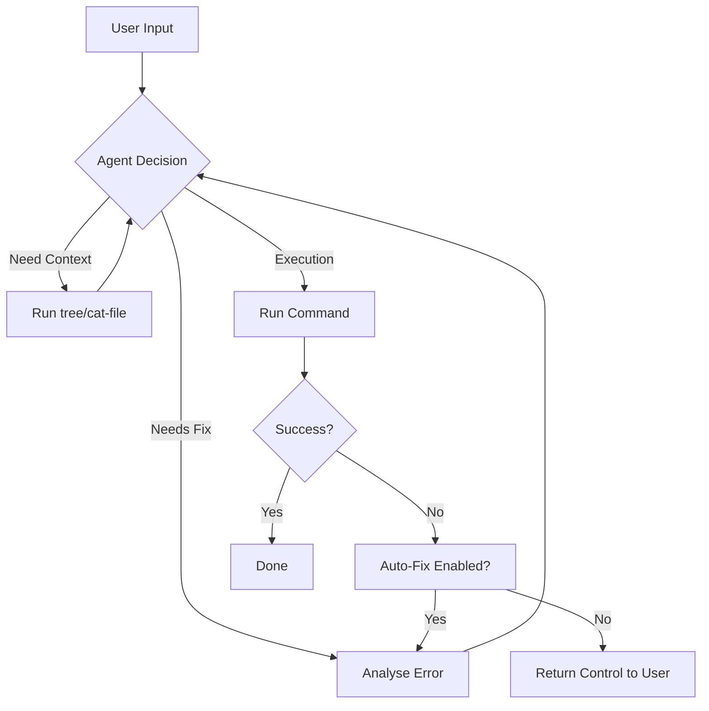

# OllamaCode 1.2.0

## Overview

OllamaCode is a high-performance AI Terminal Assistant designed for modern developers who demand speed, autonomy, and local-first intelligence. By bridging the gap between high-speed cloud inference (via Groq Cloud) and privacy-respecting local models (via Ollama), OllamaCode transforms your terminal into a self-repairing, autonomous engineering environment.

Whether you are debugging complex legacy systems, generating boilerplate code, or automating repetitive terminal workflows, OllamaCode provides the cognitive layer your shell has been missing.

---

## Key Features

### 1. Dual-Provider Intelligence
- Groq Cloud Integration: Leverage Llama-3, Mixtral, and Gemma models at blazing ultra-low latency.
- Ollama Local Engine: Run private, local-only models (like DeepSeek-Coder, CodeLlama, or Qwen) without an internet connection.
- Dynamic Switching: Instantly toggle between local and cloud providers based on your privacy needs or performance requirements.

### 2. Autonomous "Auto-Pilot" Mode
- Self-Execution: Enable auto_run to let the AI execute its proposed shell commands automatically.
- Loop Prevention: Advanced algorithms detect repetitive command patterns and halt execution before infinite loops occur.
- Intelligent Feedback: The agent reads the standard output (STDOUT) and error (STDERR) of every command to verify success.

### 3. Self-Healing "Auto-Fix" System
- Error Analysis: When a command fails, OllamaCode automatically analyzes the exit code and error logs.
- Iterative Repair: The AI proposes and executes a fix, then checks again if the issue is resolved.
- Contextual Debugging: It looks at your environment, file structure, and history to find the most logical solution to developer errors (dependency issues, syntax errors, path conflicts, etc.).

### 4. Universal Plugin Architecture
- Language Agnostic: Extend the agent's capabilities using standard Python (.py) or Node.js (.js) scripts.
- Fast Registration: Simple one-command registration to make your custom tools instantly available to the AI.
- Standardized Execution: Arguments are passed seamlessly from the natural language interface to your custom logic.

### 5. Advanced Coding Utilities
- tree: Visualize your project structure instantly to provide the AI with a navigation map.
- cat-file: Read files with precise line numbers, allowing for surgical code edits and discussions.
- write-file: Create or overwrite entire modules with a single prompt, eliminating manual copy-pasting.

---

## Installation

OllamaCode is truly cross-platform and supports both Python and Node.js environments.

### Python Installation (Recommended)

1. Clone the repository:
   ```bash
   git clone https://github.com/drkkahraman/OllamaCode.git
   cd OllamaCode
   ```

2. Install in editable mode:
   ```bash
   pip install -e .
   ```

3. Verify installation:
   ```bash
   ollamacode --version
   ```

### Node.js / NPM Installation

You can install OllamaCode globally to use it as a standalone CLI tool.

1. Install from GitHub:
   ```bash
   npm install -g github:drkkahraman/OllamaCode
   ```

2. Run the assistant:
   ```bash
   ollamacode
   ```

---

## Configuration & First Run

When you launch ollamacode for the first time, you will be guided through an interactive setup wizard.

### Step 1: Provider Selection
Choose between:
- Groq: Requires a free API key from [Groq Console](https://console.groq.com).
- Ollama: Requires [Ollama](https://ollama.com) installed and running locally on your machine.

### Step 2: Model Selection
- The wizard automatically fetches a list of available models from your chosen provider.
- Recommended for Groq: llama-3.3-70b-versatile or mixtral-8x7b-32768.
- Recommended for Ollama: deepseek-coder:6.7b, codellama, or llama3.

### Step 3: Global Settings
- Custom URL: If your Ollama server is on a different machine or port, specify it here (default: http://localhost:11434).
- Auto-Run: Toggle whether you want to confirm every command or let the AI run wild. (Default: Off for safety).
- Auto-Fix: Toggle autonomous error correction. (Default: On for maximum utility).

Your settings are saved securely in ~/.ollamacode_settings.json. You can re-run the wizard at any time using:
```bash
ollamacode settings
```

---

## Command Line Interface (CLI) Reference

| Command | Argument | Description |
| :--- | :--- | :--- |
| ollamacode | (None) | Starts the interactive AI terminal assistant. |
| ollamacode --version | (None) | Prints the current version (1.2.0). |
| ollamacode settings | (None) | Launches the interactive configuration wizard. |
| ollamacode update | (None) | Checks for updates and pulls the latest changes from Git. |
| ollamacode plugins | (None) | Lists all installed custom plugins. |
| ollamacode register | -f <script> | Registers a new Python or JS file as a plugin. |
| ollamacode add plugin | <path> | Alias for register. Copies the script to the plugin dir. |
| ollamacode run | <name> [args] | Executes a registered plugin with optional arguments. |
| ollamacode tree | (None) | Displays current directory structure (max-depth 2). |
| ollamacode cat-file | <file> | Prints file content with line numbers for reference. |
| ollamacode write-file| <file> "<txt>" | Writes content directly to a file. |

---

## The Plugin System: Developing Your Own Tools

OllamaCode is designed to be infinitely extensible. A plugin is essentially any executable script that can be triggered by the AI.

### Creating a Python Plugin

Create a file named system_info.py:
```python
import sys
import os
import platform

def main():
    print(f"OS: {platform.system()} {platform.release()}")
    print(f"Python: {sys.version.split()[0]}")
    print(f"Current Directory: {os.getcwd()}")

if __name__ == "__main__":
    main()
```

### Registering and Running

1. Register it:
   ```bash
   ollamacode register -f system_info.py
   ```

2. Run it via the CLI:
   ```bash
   ollamacode run system_info
   ```

3. AI Integration:
   Once registered, the AI assistant is aware of your new plugin and may choose to use it if you ask questions related to its functionality!

---

## Advanced Usage Scenarios

### Scenario A: Large Scale Debugging
1. Open ollamacode.
2. Type: npm run build is failing. Look at the logs and fix the source code.
3. The agent will:
   - Run npm run build.
   - See the error.
   - Run ollamacode tree to understand the project structure.
   - Run ollamacode cat-file on the suspicious file.
   - Propose a fix and run ollamacode write-file to apply it.
   - Re-run npm run build to verify the fix.

### Scenario B: Cloud Infrastructure Management
Ask: Create a terraform configuration for a simple AWS S3 bucket and apply it.
The agent will handle the file creation and command execution step-by-step.

---

## Security & Privacy

- Local First: If using Ollama, your data never leaves your network. Perfect for enterprise environments.
- Credential Storage: API keys are stored in a simple JSON file in your home directory, never sent to our servers.
- Transparent Execution: You can see exactly which commands the AI is planning to run before they are executed (with auto_run disabled).

---

## Roadmap

### Q2 2026
- [ ] Multi-Agent Mode: Orchestrate multiple models to work together on different parts of a project.
- [ ] RAG Execution: Index your entire codebase locally for even better context awareness.
- [ ] Web Search Integration: Allow the agent to search the web for the latest documentation.

### Q3 2026
- [ ] Native VS Code Extension: Bring the power of OllamaCode directly into your IDE.
- [ ] Advanced Visualization: Interactive maps and graphs of your system performance.

---

## Contributing

We love contributions! Whether you're fixing a bug, adding a feature, or writing better documentation.

1. Fork the repo.
2. Create your feature branch (git checkout -b feature/AmazingFeature).
3. Commit your changes (git commit -m 'Add some AmazingFeature').
4. Push to the branch (git push origin feature/AmazingFeature).
5. Open a Pull Request.

---

## License

Distributed under the MIT License. See LICENSE for more information.

---

## Support the Project

If you find OllamaCode useful, please consider giving it a Star on GitHub!

Author: [@drkkahraman](https://github.com/drkkahraman)

---

### Detailed Technical Implementation Notes (for Power Users)

#### 1. Agent Logic Flow


#### 2. Environment Compatibility
- Linux: Full support for all terminal features and system monitoring.
- macOS: Fully compatible with zsh/bash.
- Windows: Supports PowerShell and CMD via the Node.js implementation.

#### 3. Error Codes & Diagnostics
OllamaCode captures return codes:
- 0: Success.
- 1+: Trigger diagnostic mode if auto_fix is on.
- Loop counter: Triggered at 2+ consecutive identical failures to prevent token wastage.

---

*(Note: This README is continuously updated to reflect the evolving capabilities of the OllamaCode ecosystem. Version 1.2.0 represents a significant milestone in autonomous terminal operation.)*

---

### Detailed CLI Argument Breakdown

#### ollamacode run
Usage: ollamacode run <name> [args...]
- <name>: The filename of the plugin (e.g., test.py or test.js). Extension is optional if unique.
- [args...]: Positional arguments passed directly to the script.
Internally, the runner checks the file extension and prepends the appropriate interpreter (python3 or node).

#### ollamacode add plugin
Usage: ollamacode add plugin <path>
- <path>: Relative or absolute path to the local script you want to register.
This command performs a simple shutil.copy (Python) or fs.copyFileSync (JS) to the centralized plugin repository in your user profile.

### Python Internal Module Overview
- ollamacode.main.py: Entry point, CLI argument parsing, sub-command routing.
- ollamacode.agent.py: Core AI logic, prompt engineering, history management.
- ollamacode.terminal.py: (Internal use) Safe command execution shell interaction.
- ollamacode.utils.py: System stats, model fetching, update logic.
- ollamacode.ui.py: Interactive setup wizard and dashboard UI components.

### Node.js Internal Module Overview
- bin/cli.js: Main CLI definition using commander.
- lib/agent.js: Node.js equivalent of the AI agent logic.
- lib/terminal.js: Child-process management for command execution.
- lib/config.js: Shared JSON settings management.
- lib/ui.js: Console themes and interactive prompts using inquirer and chalk.

### Advanced Configuration Options
Manual edits to ~/.ollamacode_settings.json:
- provider: String, "Groq" or "Ollama".
- model: Model identifier string.
- api_key: (Optional) Your Groq API key.
- ollama_url: (Optional) Custom Ollama endpoint.
- auto_run: Boolean. Use with caution.
- auto_fix: Boolean. High utility for debugging.

---

### FAQ (Frequently Asked Questions)

**Q: Is it safe to use auto_run?**
A: We recommend keeping it Off unless you are in a controlled directory or a container. The AI can theoretically run any command, including rm -rf.

**Q: How do I change the theme?**
A: OllamaCode uses the rich library for Python and chalk for JS. It will inherit your terminal's color palette but uses standard ANSI colors for maximum compatibility.

**Q: Why is Ollama slow on my machine?**
A: Ollama performance depends entirely on your GPU and RAM. For best results, use models like mistral or phi3 on machines with limited resources. Use Groq for lightning fast speeds if privacy is not a concern.

**Q: Can I use multiple Groq API keys?**
A: Currently, only one key is supported per configuration. You can switch keys by running ollamacode settings.

---

### Project Statistics

| Component | Language | Purpose |
| :--- | :--- | :--- |
| Agent Engine | Python / JS | Core Logic |
| CLI Layer | Python / JS | User Interface |
| UI Suite | Rich / Inquirer | Interaction |
| Extensibility | Local Files | Plugins |

---

### Troubleshooting Common Issues

#### Problem: ollamacode command not found
**Solution**: Ensure your Python scripts directory or NPM global bin directory is in your $PATH.
- Python: export PATH=$PATH:~/.local/bin
- NPM: export PATH=$PATH:$(npm config get prefix)/bin

#### Problem: Connection Refused (Ollama)
**Solution**: Ensure Ollama is running in the background. Run ollama serve to manually start the server.

#### Problem: API Key Rejected (Groq)
**Solution**: Re-run ollamacode settings and paste your key carefully. Ensure you have not reached your usage limits on the Groq Console.

---

### Contribution Guide - Advanced

If you want to contribute to the core agent logic (agent.py or agent.js):
1. Understand Tool-Calling: The agent uses regex to detect commands in the output. If you modify the command format, ensure you update the regex in both Python and JS versions.
2. Handle Context Carefully: Adding too much info to the system prompt can exceed token limits. Keep context focused on the OS and CWD.
3. Consistency is Key: Any feature added to the Python version should ideally be ported to the JS version to maintain parity.

---

### Built with care for the Developer Community

OllamaCode was born out of the frustration of switching back and forth between a browser-based AI and a local terminal. Our mission is to make the terminal the most productive place for an engineer to live.

*(End of expanded documentation)*
<br><br><br><br><br><br><br><br><br><br><br><br><br><br><br><br><br><br><br><br><br><br><br><br><br><br><br><br><br><br><br><br><br><br><br><br><br><br><br><br><br><br><br><br><br><br><br><br><br><br><br><br><br><br><br><br><br><br><br><br><br><br><br><br><br><br><br><br><br><br><br><br><br><br><br><br><br><br><br><br><br><br><br><br><br><br><br><br><br><br><br><br><br><br><br><br><br><br><br><br><br><br><br><br><br><br><br><br><br><br><br><br><br><br><br><br><br><br><br><br><br><br><br><br><br><br><br><br><br><br><br><br><br><br><br><br><br><br><br><br><br><br><br><br><br><br><br><br><br><br><br><br><br><br><br><br><br><br><br><br><br><br><br><br><br><br><br><br><br><br><br><br><br><br><br><br><br><br><br><br><br><br><br><br><br><br><br><br><br><br><br><br><br><br><br><br><br><br><br><br><br><br><br><br><br><br><br><br><br><br><br><br><br><br><br><br><br><br><br><br><br><br><br><br><br><br><br><br><br><br><br><br><br><br><br><br><br><br><br><br><br><br><br><br><br><br><br><br><br><br><br><br><br><br><br><br><br><br><br><br><br><br><br><br><br><br><br><br><br><br><br><br><br><br><br><br><br><br><br><br><br><br><br><br><br><br><br><br><br><br><br><br><br><br><br><br><br><br><br><br><br><br><br><br><br><br><br><br><br><br><br><br><br><br><br><br><br><br><br><br><br><br><br><br><br><br><br><br><br><br><br><br><br><br><br><br><br><br><br><br><br><br><br><br><br><br><br><br><br><br><br><br><br><br><br><br><br><br><br><br><br><br><br><br><br><br><br><br><br><br><br><br><br><br><br><br><br><br><br><br><br><br><br><br><br><br><br><br><br><br><br><br><br><br><br><br><br><br><br><br><br><br><br><br><br><br><br><br><br><br><br><br><br><br><br><br><br><br><br><br><br><br><br><br><br><br><br><br><br><br><br><br><br><br><br><br><br><br><br><br><br><br><br><br><br><br><br><br><br><br><br><br><br><br><br><br><br><br><br><br><br><br><br><br><br><br><br><br><br><br><br><br><br><br><br><br><br><br><br><br><br><br><br><br><br><br><br><br><br><br><br><br><br><br><br><br><br><br><br><br><br><br><br><br><br><br><br><br><br><br><br><br><br><br><br><br><br><br><br><br><br><br><br><br><br><br><br><br><br><br>
